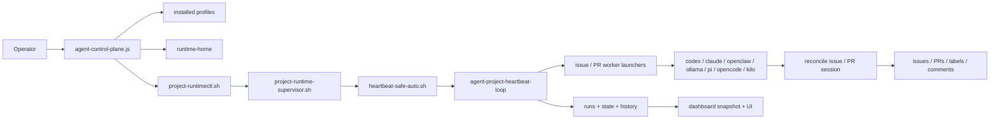
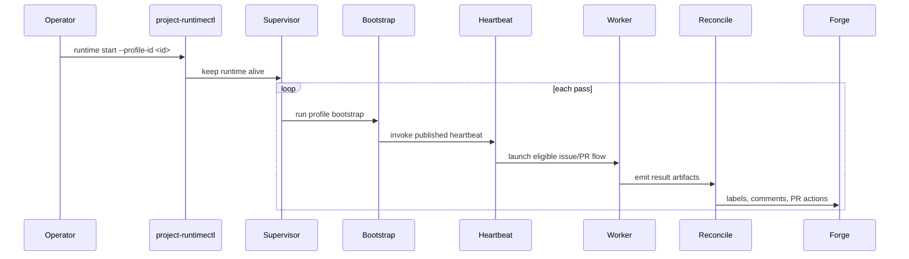

# agent-control-plane

<p>
  <a href="https://github.com/ducminhnguyen0319/agent-control-plane/actions/workflows/ci.yml"></a>
  <a href="https://www.npmjs.com/package/agent-control-plane"></a>
  <a href="https://www.npmjs.com/package/agent-control-plane"></a>
  <a href="./LICENSE"></a>
  <a href="https://github.com/sponsors/ducminhnguyen0319"></a>
  <a href="https://socket.dev/npm/package/agent-control-plane"></a>
</p>

`agent-control-plane` (ACP) keeps your coding agents running reliably without
you having to stare at them all day.

It is the operator layer for coding agents that need to keep running after the
novelty wears off — and the responsible adult in the room that stops them from
going completely off the rails.

- License: [`MIT`](./LICENSE)
- Changelog: [CHANGELOG.md](./CHANGELOG.md)
- Roadmap: [ROADMAP.md](./ROADMAP.md)
- Architecture: [references/architecture.md](./references/architecture.md)
- Commands: [references/commands.md](./references/commands.md)

## The Big Idea

Here is the dirty secret nobody in the AI hype cycle wants to admit: **the free
models are not that dumb.** They are just chaotic. Left alone to manage their
own execution loop, retry logic, GitHub labels, and publish pipeline, they will
reliably discover creative new ways to do absolutely nothing useful at 3am while
you sleep. Give them a tight operating harness and a clear job description,
however, and suddenly that "not smart enough" free model is grinding through
your issue backlog like a junior developer who is weirdly enthusiastic about
reading CI logs.

That is what ACP does. It turns a forge-backed repo into a managed runtime: a
repeatable setup, a stable home for state, a heartbeat that keeps agents
scheduled and supervised, and a dashboard you can actually glance at without
spelunking through temp folders, worktrees, or half-remembered `tmux` sessions.

ACP does not try to be the coding agent. It makes the surrounding system less
fragile: profile setup, runtime start and stop, heartbeat scheduling,
reconcile-owned outcomes, background execution, and operator visibility under
`~/.agent-runtime`. The agent writes the code. ACP writes the boring
infrastructure that keeps the agent from losing its own work.

### Free models: surprisingly economical

If you are using ACP for research, the economics are almost embarrassing.
Running a free-tier model like `openrouter/qwen3.6-plus:free` continuously
across multiple repos costs roughly what a large latte costs — per month, not
per hour. ACP handles quota cooldowns, stall detection, provider failover, and
retry backoff, so free-tier models become genuinely useful in a production-shaped
loop instead of a toy demo. For researchers studying agent behavior, measuring
output quality, or iterating on prompting strategies at scale: you can run
hundreds of sessions for what you would otherwise spend on a single GPT-4
afternoon.

**The free model is not brilliant. ACP makes it relentless.**

### Smarter models: powerful, and worth supervising

ACP works equally well with Claude Sonnet, OpenAI Codex, and other
high-capability backends. They produce better code, handle harder tasks, and
generally understand the first time what the free model needed three attempts and
a blocker comment to figure out.

But here is the thing about powerful AI agents running autonomously against your
GitHub repo: they are, in a very real sense, a slow-burning fuse. An agent with
broad permissions, no supervision, and no circuit breakers will eventually push
something broken, auto-merge a PR it should not have touched, burn through a
monthly API budget in a long weekend, or enter a retry loop that only stops when
the credit card does.

ACP is the person standing next to the fuse. It enforces launch limits,
reconciles outcomes before touching your forge, validates before it publishes, and
respects cooldowns instead of hammering a provider at full throttle. The agent
gets to be smart and fast. ACP makes sure "smart and fast" does not also mean
"unattended and irreversible."

You would not hand a brilliant but impulsive junior developer the repository
admin key and leave for a two-week vacation. ACP is the on-call rotation for
your AI workforce — quiet when things go well, essential when they do not.

## Why people use it

ACP is a good fit when your pain is not "the agent cannot code" but "the setup
around the agent is too easy to break" — or "I would trust this agent more if
it had a supervisor."

| Need | What ACP provides |
| --- | --- |
| Keep agent workflows running without babysitting | Supervisor, heartbeat loop, and reconcile scripts that manage the lifecycle automatically |
| Get real value out of free-tier models | Quota cooldowns, stall detection, provider failover, and retry backoff that free-tier models need to be actually useful |
| Manage multiple repos cleanly | One profile per repo with isolated runtime state, each with its own identity and status |
| Observe what is happening without digging through files | Dashboard and `runtime status` that show the real state without spelunking through `tmux` or temp folders |
| Compare worker backends on real workloads | Swap between `codex`, `claude`, `openclaw`, `ollama`, `pi`, `opencode`, and `kilo` without rebuilding your runtime habits |
| Run reproducible agent research cheaply | Cost-controlled execution harness for studying agent behavior, output quality, or prompting strategies |
| Enforce safety by architecture, not by hope | Launch limits, reconcile gates, and cooldowns that are built into the runtime, not left to chance |

## Why Gitea Local-First

ACP started GitHub-first, but a local-first Gitea loop is often a better daily
working setup:

- It reduces dependence on GitHub API rate limits for routine issue and PR work.
- It lets agents collaborate against a local forge while you keep GitHub as the
  public mirror or release boundary.
- It gives you a safer place to let ACP iterate quickly, because local Gitea is
  cheaper to reset, inspect, and isolate than a live hosted repo.
- It matches how ACP now works best operationally: local runtime state,
  local worktrees, local dashboard, and a forge that can live on the same
  machine.

The intended model is:

- `Gitea main` is the working mainline ACP automates day to day.
- Your local source checkout auto-syncs from that forge mainline.
- GitHub becomes the publish/release mirror once the codebase is stable enough
  to push outward.

## Use Cases

Teams and solo builders usually reach for ACP when one of these starts to feel
familiar:

- Issue-driven or PR-driven agent work should keep running in the background,
  but still be inspectable and recoverable when something goes wrong.
- The project has more than one repo, and each one deserves a clean, separate
  runtime identity instead of sharing state.
- You want to swap or compare worker backends without rebuilding your runtime
  setup from scratch every time.
- You want one command to tell you whether automation is healthy, instead of
  inferring it from stale branches, dangling sessions, or mystery files under
  `/tmp`.
- You are doing research on agent behavior, output quality, or prompt strategy
  and need a reproducible, cost-controlled execution harness.
- Your local machine should behave like a reliable operator box, not a pile of
  shell history that breaks after a reboot.

## Roadmap

ACP is moving toward a true multi-backend control plane. The goal is one runtime
and one dashboard for many coding-agent backends, across macOS, Linux, and Windows (WSL2)
Windows.

### Backend Status

| Backend | Status | Notes |
| --- | --- | --- |
| `codex` | Production-ready | Full ACP workflow support today. |
| `claude` | Production-ready | Full ACP workflow support today. |
| `openclaw` | Production-ready | Full ACP workflow, including resident-style runs. |
| `ollama` | **Hardening** | Working adapter with Node.js agentic loop. **v0.4.9+: Added health-check + context detection.** Moved toward production-ready. |
| `pi` | Experimental | Working adapter using the pi CLI. **Health-check + API key validation.** |
| `opencode` | Experimental | Working adapter for Crush. **Health-check (verify `crush` binary).** |
| `kilo` | Experimental | Working adapter for Kilo Code. **Health-check + JSON stream validation.** |
| `gemini-cli` | **Integrated** | Google's official terminal agent (v0.39.1+). Full ACP adapter with health-check, API key validation, and streaming JSON output. |
| `nanoclaw` | Not integrable | Standalone agent system (like ACP), not a CLI backend. Reference for container patterns. |
| `picoclaw` | Not integrable | Standalone agent system (Go-based). Runs on $10 hardware. Not a CLI backend. |

### Adapter Pattern

ACP uses a **standardized adapter interface** to support multiple backends. Every adapter implements these functions:

| Function | Purpose |
| --- | --- |
| `adapter_info()` | Print adapter metadata (id, name, type, version, model) |
| `adapter_health_check()` | Verify backend is available (exit 0 = healthy) |
| `adapter_run()` | Execute a task (params: MODE SESSION WORKTREE PROMPT_FILE) |
| `adapter_status()` | Get run status for a session |

**Available adapters:**
- `tools/bin/ollama-adapter.sh` - Ollama local models (implements health-check)
- All existing backends (`codex`, `claude`, `pi`, `opencode`, `kilo`) use the same interface via `run-codex-task.sh`, `run-claude-task.sh`, etc.

**Using adapters:**

```bash
# Print adapter info
bash tools/bin/ollama-adapter.sh

# Run a task with generic runner
bash tools/bin/run-with-adapter.sh tools/bin/ollama-adapter.sh safe my-session /path/to/worktree /path/to/prompt.txt
```

See `tools/bin/adapter-interface.sh` for the full interface specification.

If you are trying ACP on a real repo right now, start with `codex`, `claude`,
or `openclaw`. Use `ollama` to run local models — useful for research, offline
workflows, or comparing local model output against cloud backends without
incurring API costs. Use `pi` to experiment with OpenRouter-hosted free-tier
models via the pi CLI. The remaining entries show the direction of travel, not
finished support.

See [ROADMAP.md](./ROADMAP.md) for the fuller public roadmap.

### Using Ollama (local models)

To run ACP with a local model via [Ollama](https://ollama.com):

```bash
# 1. Install Ollama and pull a model
ollama pull qwen3.5:9b

# 2. Init a profile with ollama backend
npx agent-control-plane@latest init \
  --profile-id my-repo \
  --repo-slug owner/my-repo \
  --repo-root ~/src/my-repo \
  --agent-root ~/.agent-runtime/projects/my-repo \
  --worktree-root ~/src/my-repo-worktrees \
  --coding-worker ollama

# 3. Configure the model in your profile YAML
#    ~/.agent-runtime/control-plane/profiles/my-repo/control-plane.yaml
#
#    execution:
#      coding_worker: "ollama"
#      ollama:
#        model: "qwen3.5:9b"
#        base_url: "http://localhost:11434"
#        timeout_seconds: 900
```

The Ollama adapter runs a Node.js agentic loop that calls the Ollama API with
tool-use support. It handles both native tool-call responses and models that
return tool calls as JSON text in the content field.

**Model guidance:** Models in the 7–14B range can explore codebases and run
commands, but may struggle with complex multi-step repair tasks. Larger models
(27B+) produce significantly better results if your hardware supports them.
Thinking mode is disabled by default (`think: false`) and context is set to
32K tokens to balance speed and capability.

## See It Running

The dashboard gives you a single view across all active profiles — running
sessions, recent history, provider cooldowns, scheduled issues, and queue state.


## Architecture

ACP is easiest to trust once you can see the moving pieces. The npm package
stages a shared runtime, installed profiles live outside the package, a shared
heartbeat loop decides what to launch, worker adapters do the coding work, and
reconcile scripts own the GitHub-facing outcome.



### Runtime Loop At A Glance



Architecture shortcuts:

- [System overview](./references/architecture.md#system-overview)
- [Install and publication flow](./references/architecture.md#install-and-publication-flow)
- [Runtime scheduler loop](./references/architecture.md#runtime-scheduler-loop)
- [Worker session lifecycle](./references/architecture.md#worker-session-lifecycle)
- [Dashboard snapshot pipeline](./references/architecture.md#dashboard-snapshot-pipeline)
- [Control plane ownership map](./references/control-plane-map.md)

Visual assets:

- [Architecture deck PDF](./assets/architecture/agent-control-plane-architecture.pdf)
- [Overview infographic](./assets/architecture/overview-infographic.png)
- [Runtime loop infographic](./assets/architecture/runtime-loop-infographic.png)
- [Worker lifecycle infographic](./assets/architecture/worker-lifecycle-infographic.png)
- [State and dashboard infographic](./assets/architecture/state-dashboard-infographic.png)

## Prerequisites

ACP is a shell-first operator tool. Most install problems become easier to
debug once it is clear which dependency is responsible for which part of the
system.

| Tool | Required | Purpose | Notes |
| --- | --- | --- | --- |
| Node.js `>= 18` | yes | Runs the npm package entrypoint and `npx` wrapper. | CI runs on Node `22`. Node `20` or `22` both work fine. |
| `bash` | yes | All runtime, profile, and worker orchestration scripts are Bash. | Your login shell can be `zsh`; `bash` just needs to be on `PATH`. |
| `git` | yes | Manages worktrees, checks branch state, and coordinates repo automation. | Required even if you interact only through forge issues and PRs. |
| `gh` | for GitHub-first setups | GitHub CLI auth and API access for issues, PRs, labels, and metadata. | Run `gh auth login` before first use when `--forge-provider github`. |
| `jq` | yes | Parses JSON from `gh` output and worker metadata throughout. | Missing `jq` will break GitHub-heavy and Gitea-heavy runtime flows. |
| `python3` | yes | Powers the dashboard server, snapshot renderer, and config helpers. | Required for both dashboard use and several internal scripts. |
| `tmux` | yes | Runs long-lived worker sessions and captures their status. | Missing `tmux` means background worker workflows will not launch. |
| Worker CLI (backend-specific) | depends on backend | The coding agent for a profile. Supported: `codex`, `claude`, `openclaw` (production); `ollama`, `pi`, `opencode`, `kilo` (experimental). | Install and authenticate your chosen backend before starting background runs. |
| `ollama` | for `ollama` backend | Serves local models via OpenAI-compatible API at `http://localhost:11434`. | Install from [ollama.com](https://ollama.com) and pull a model (e.g. `ollama pull qwen3.5:9b`) before use. |
| `pi` CLI | for `pi` backend | Lightweight coding agent using OpenRouter-compatible APIs. | Install via `npm i -g @mariozechner/pi-coding-agent`. Set `OPENROUTER_API_KEY` before use. |
| `crush` (opencode) | for `opencode` backend | Go-based coding agent by Charm ([charmbracelet/crush](https://github.com/charmbracelet/crush)). | Install via `brew install charmbracelet/tap/crush`. |
| `kilo` CLI | for `kilo` backend | TypeScript coding agent ([kilocode/cli](https://github.com/Kilo-Org/kilocode)). | Install via `npm i -g @kilocode/cli`. |
| Bundled `codex-quota` + ACP quota manager | automatic for Codex | Quota-aware failover and health signals for Codex profiles. | Bundled by default. Override with `ACP_CODEX_QUOTA_BIN` only if you have a custom setup. |

Make sure your chosen worker backend is authenticated for the same OS user
before starting any background runtime. For GitHub-first setups, authenticate
`gh`. For Gitea local-first setups, provide `--gitea-base-url` plus a token or
username/password during setup so ACP can write issues, PR comments, and labels.

## Install

The easiest way to try ACP is with `npx`:

```bash
npx agent-control-plane@latest help
```

If you use it often, a global install gives you a shorter command:

```bash
npm install -g agent-control-plane
agent-control-plane help
```

The examples below use `npx agent-control-plane@latest ...`, but every command
works the same way after a global install.

## First Run

### Option A — Guided setup (recommended)

The fastest path is the interactive wizard:

```bash
npx agent-control-plane@latest setup
```

The wizard walks you through the full setup in one pass:

1. Detects the current repo and suggests sane defaults
2. Captures forge mode (`github` or `gitea`) and the auth/settings that mode needs
3. Checks backend readiness (API keys for openclaw/pi, local server for ollama)
4. Scaffolds the profile, runs health checks, starts the runtime
5. Launches the monitoring dashboard in the background
6. Offers to create recurring starter issues so ACP starts working immediately

After the wizard finishes, your repo has a running agent, a live dashboard,
and a set of `agent-keep-open` issues that ACP will continuously work through.

To preview exactly what it would do before touching anything:

```bash
npx agent-control-plane@latest setup --dry-run
```

For non-interactive use (CI, scripted installs, GUI frontends):

```bash
npx agent-control-plane@latest setup \
  --non-interactive \
  --install-missing-deps \
  --start-runtime \
  --start-dashboard \
  --create-starter-issues \
  --json
```

With `--json`, ACP emits a single structured object on `stdout` and sends
progress logs to `stderr`, which keeps parsing stable.

Example: local-first Gitea setup

```bash
npx agent-control-plane@latest setup \
  --forge-provider gitea \
  --repo-slug acp-admin/my-repo \
  --gitea-base-url http://127.0.0.1:3000 \
  --gitea-token <token> \
  --start-runtime \
  --start-dashboard
```

This writes the forge settings into the profile `runtime.env`, so later
heartbeat, reconcile, and publish steps keep talking to the same Gitea
instance without extra shell exports.

### Option B — Manual setup

If you prefer explicit control over each step:

**1. Authenticate the working forge**

```bash
gh auth login
```

For Gitea local-first, skip `gh auth login` and pass Gitea settings directly to
`setup` or `init`:

```bash
--forge-provider gitea \
--gitea-base-url http://127.0.0.1:3000 \
--gitea-token <token>
```

**2. Install the packaged runtime**

```bash
npx agent-control-plane@latest sync
```

This stages the ACP runtime into `~/.agent-runtime/runtime-home`. Safe to
re-run after upgrades.

**3. Create a profile for your repo**

```bash
npx agent-control-plane@latest init \
  --profile-id my-repo \
  --repo-slug owner/my-repo \
  --forge-provider github \
  --repo-root ~/src/my-repo \
  --agent-root ~/.agent-runtime/projects/my-repo \
  --worktree-root ~/src/my-repo-worktrees \
  --coding-worker openclaw
```

| Flag | Purpose |
| --- | --- |
| `--profile-id` | Short name used in all ACP commands |
| `--repo-slug` | Forge repo ACP should track |
| `--forge-provider` | Which forge ACP should automate (`github` or `gitea`) |
| `--gitea-base-url` | Base URL when `--forge-provider gitea` |
| `--repo-root` | Path to your local checkout |
| `--agent-root` | Where ACP keeps per-project runtime state |
| `--worktree-root` | Where ACP places repo worktrees |
| `--coding-worker` | Backend to orchestrate (`codex`, `claude`, `openclaw`, `ollama`, `pi`, `opencode`, or `kilo`) |

**4. Validate before trusting it**

```bash
npx agent-control-plane@latest doctor
npx agent-control-plane@latest profile-smoke --profile-id my-repo
```

`doctor` checks installation health. `profile-smoke` gives the profile a fast
confidence pass before you turn on background loops.

**5. Start the runtime**

```bash
npx agent-control-plane@latest runtime start --profile-id my-repo
npx agent-control-plane@latest runtime status --profile-id my-repo
```

Once `runtime status` returns clean output, ACP is actively managing the
runtime for that profile. Per-profile state lives under `~/.agent-runtime`,
grouped and inspectable without digging through scattered temp files.

## Starter Issues

The setup wizard can create a set of recurring `agent-keep-open` issues on your
repo so ACP starts working immediately after installation. ACP picks them up on
its next heartbeat cycle without requiring a separate readiness label.

Built-in templates:

| Issue | What ACP does |
| --- | --- |
| Code quality sweep | Fix lint warnings, type errors, and dead code |
| Test coverage improvement | Add tests for critical untested modules |
| Documentation refresh | Keep README and inline docs accurate |
| Dependency audit | Fix vulnerabilities and update safe patches |
| Refactoring sweep | Reduce complexity and duplication |

You can also create your own recurring issues by adding the
`agent-keep-open` label to any GitHub issue. ACP will keep revisiting that
issue continuously unless it is blocked or already claimed by an open agent PR.

To skip this step during setup, pass `--no-create-starter-issues`.

## Everyday Usage

```bash
# Check runtime state
npx agent-control-plane@latest runtime status --profile-id my-repo

# Restart the runtime
npx agent-control-plane@latest runtime restart --profile-id my-repo

# Stop the runtime
npx agent-control-plane@latest runtime stop --profile-id my-repo

# Run smoke checks
npx agent-control-plane@latest profile-smoke --profile-id my-repo
npx agent-control-plane@latest smoke
```

## Dashboard

```bash
npx agent-control-plane@latest dashboard --host 127.0.0.1 --port 8765
```

Then open `http://127.0.0.1:8765`.

The dashboard shows all active profiles in one place: running sessions, recent
run history, provider cooldowns, scheduled issues, and queue state — without
having to dig through `tmux` panes or temp folders.

## macOS Autostart

Install a per-profile LaunchAgent so the runtime survives reboots:

```bash
npx agent-control-plane@latest launchd-install --profile-id my-repo
```

Remove it:

```bash
npx agent-control-plane@latest launchd-uninstall --profile-id my-repo
```

These commands are macOS-only and manage per-user `launchd` agents.

## Windows (WSL2) Autostart

ACP runs inside WSL2 (Windows Subsystem for Linux) where it uses systemd for service management. This requires WSL2 with systemd enabled (Windows 11 22H2+).

**Prerequisites:**
1. Install WSL2 with Ubuntu: `wsl --install -d Ubuntu` (in PowerShell Admin)
2. Enable systemd in WSL2 (create `/etc/wsl.conf` with `[boot] systemd=true`)
3. Run `wsl --shutdown` from PowerShell, then restart WSL2

**Install project service in WSL2:**

```bash
# Inside WSL2 Ubuntu terminal
cd /mnt/c/Users/You/Projects/your-repo

# Bootstrap systemd service (same as Linux)
agent-control-plane project systemd-bootstrap \
  --project-dir . \
  --repo-url https://github.com/your-org/your-repo.git \
  --worker-type claude \
  --schedule "*/30 * * * *" \
  --issues "1,2,3"
```

**Manage the service:**

```bash
systemctl --user daemon-reload
systemctl --user enable --now agent-control-plane@$(basename $(pwd)).timer
systemctl --user status agent-control-plane@$(basename $(pwd)).timer
```

See [WSL2_SETUP.md](docs/WSL2_SETUP.md) for full setup guide, Docker in WSL2, and troubleshooting.

## Update

After upgrading the package, refresh the runtime and verify health:

```bash
npx agent-control-plane@latest sync
npx agent-control-plane@latest doctor
npx agent-control-plane@latest smoke   # optional confidence check
```

## Remove a Profile

Remove one profile and its ACP-managed runtime state:

```bash
npx agent-control-plane@latest remove --profile-id my-repo
```

Also remove ACP-managed repo and worktree directories:

```bash
npx agent-control-plane@latest remove --profile-id my-repo --purge-paths
```

Use `--purge-paths` only when you want ACP-managed directories deleted too.

## Troubleshooting

| Symptom | Fix |
| --- | --- |
| `profile not installed` | Run `init` first, then retry with the same `--profile-id`. |
| `explicit profile selection required` | Pass `--profile-id <id>` to `runtime`, `launchd-install`, `launchd-uninstall`, and `remove`. |
| `gh` cannot access the repo | Re-run `gh auth login` and confirm the repo slug in the profile is correct. |
| Setup deferred anchor repo sync | ACP could not reach the repo remote. Fix Git access or the remote URL, then re-run `setup` or `init` without `--skip-anchor-sync`. |
| Backend auth failures | Authenticate the backend before starting ACP. For `openclaw`/`pi`, set `OPENROUTER_API_KEY`. For `ollama`, ensure the server is running. For `opencode`/`kilo`, install and authenticate the CLI. |
| Node older than `18` | Upgrade Node first. ACP's minimum version is `18+`. |
| Missing `jq` | Install `jq`, then retry the failed command. |
| Runtime or source drift after an update | Run `sync`, then `doctor`. |
| Missing `tmux`, `gh`, or `python3` | Install the dependency, then retry `sync` or `runtime start`. |
| Missing `codex-quota` warning | This is optional. Core ACP and all non-Codex flows do not require it. |

## Command Summary

| Command | Purpose |
| --- | --- |
| `help` | Show the full CLI surface. Good first command on a new machine. |
| `version` | Print the running package version. |
| `setup [--dry-run] [--json]` | Guided bootstrap wizard. Detects repo, installs deps, scaffolds profile, starts runtime and dashboard, creates starter issues. `--dry-run` previews. `--json` emits structured output. |
| `sync` / `install` | Stage or refresh the packaged runtime into `~/.agent-runtime/runtime-home`. Run after install or upgrade. |
| `init ...` | Scaffold one repo profile manually. Requires `--profile-id`, `--repo-slug`, `--repo-root`, `--agent-root`, `--worktree-root`, `--coding-worker`. |
| `doctor` | Inspect runtime and source installation health. |
| `profile-smoke [--profile-id <id>]` | Validate one profile before trusting it with real work. |
| `runtime <status\|start\|stop\|restart> --profile-id <id>` | Operate one profile runtime. |
| `dashboard [--host] [--port]` | Start the local monitoring dashboard. Defaults: `127.0.0.1:8765`. |
| `launchd-install --profile-id <id>` | Install a per-profile LaunchAgent on macOS. |
| `launchd-uninstall --profile-id <id>` | Remove a per-profile LaunchAgent on macOS. |
| `remove --profile-id <id> [--purge-paths]` | Remove a profile and its ACP-managed state. `--purge-paths` also deletes managed directories. |
| `smoke` | Run the packaged smoke suite for the shared control plane. |

For a lower-level script map, see [references/commands.md](./references/commands.md).

## Support the Project

If ACP saves you time or keeps your agent workflows sane, you can support the
project via [GitHub Sponsors](https://github.com/sponsors/ducminhnguyen0319).

The open source core stays free. If you fork or republish this package under
another maintainer account, update the sponsor links in `package.json` and
`.github/FUNDING.yml`.

**Sponsorship policy:** Sponsorships are maintainer-managed project support.
They do not transfer ownership, copyright, patent rights, or control over the
project. Contributors are not automatically entitled to sponsorship payouts. The
maintainer may direct funds toward maintenance, infrastructure, contributor
rewards, or other project-related work at their discretion.

## Contributing

Contributions are welcome. This repo uses a contributor agreement so the
project can stay easy to maintain and relicense if needed.

- Contribution guide: [CONTRIBUTING.md](./CONTRIBUTING.md)
- Contributor agreement: [CLA.md](./CLA.md)

## Security

Do not open a public issue for vulnerabilities.

- Security policy: [SECURITY.md](./SECURITY.md)
- Code of conduct: [CODE_OF_CONDUCT.md](./CODE_OF_CONDUCT.md)

## Releases

- Release history: [CHANGELOG.md](./CHANGELOG.md)
- Maintainer checklist: [references/release-checklist.md](./references/release-checklist.md)
