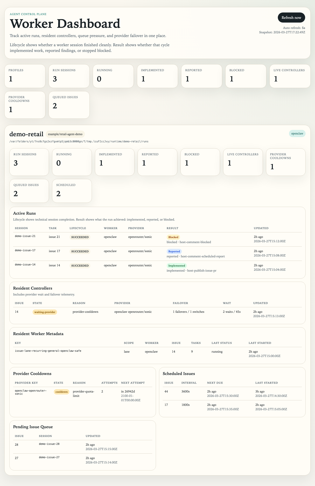
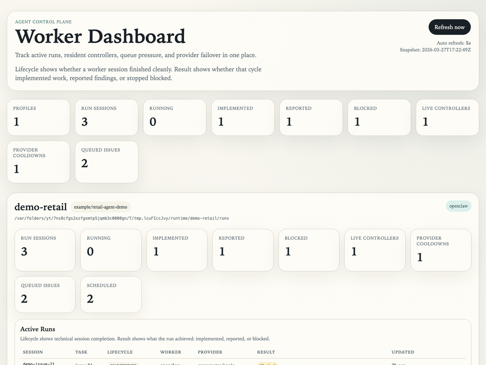
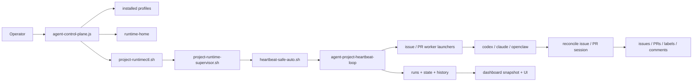
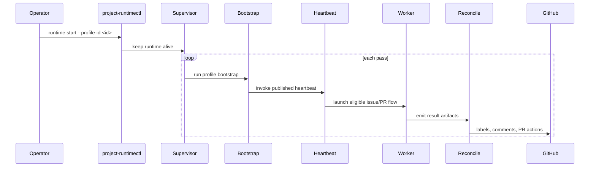

# agent-control-plane

<p>
  <a href="https://github.com/ducminhnguyen0319/agent-control-plane/actions/workflows/ci.yml"></a>
  <a href="https://www.npmjs.com/package/agent-control-plane"></a>
  <a href="https://www.npmjs.com/package/agent-control-plane"></a>
  <a href="./LICENSE"></a>
  <a href="https://github.com/sponsors/ducminhnguyen0319"></a>
</p>

`agent-control-plane` helps a repo keep coding agents running reliably without
constant human babysitting.

It is the operator layer for coding agents that need to keep running after the
novelty wears off.

License: `MIT`

Changelog: [CHANGELOG.md](./CHANGELOG.md)

Roadmap: [ROADMAP.md](./ROADMAP.md)

Architecture: [references/architecture.md](./references/architecture.md)

Commands: [references/commands.md](./references/commands.md)

It turns a GitHub repo into a managed runtime with a repeatable setup, a stable
place for state, a real status command, and a dashboard you can glance at
without spelunking through temp folders, worktrees, or half-remembered `tmux`
sessions.

ACP does not try to be the coding agent itself. It makes the surrounding system
less fragile: profile setup, runtime start and stop, heartbeat scheduling,
reconcile-owned outcomes, background execution, and operator visibility under
`~/.agent-runtime`.

The promise is intentionally boring in the best possible way: your agents stay
busy, your runtime stays understandable, and the repo keeps moving even when
you are not sitting there manually babysitting every loop, retry, or publish
decision.

## Why people use it

ACP is useful when you want agent workflows to feel operational instead of
fragile, improvised, or tied to one lucky terminal session.

- replace human babysitting with boring runtime ownership: supervisor,
  heartbeat, reconcile, and status tooling
- one profile per repo, so every project has a clear runtime identity
- start, stop, restart, and status commands that behave like operator tooling
- dashboard visibility instead of hunting through `tmux` panes and temp folders
- smoke checks before you trust the runtime on real work
- optional macOS autostart so a reboot does not reset your flow
- room for multiple worker backends without changing how you operate the repo

ACP is a good fit when your pain is not "the agent cannot code" but "the setup
around the agent is too easy to break."

## Use Cases

Teams and solo builders usually reach for ACP when one of these starts to feel
familiar:

- you want issue-driven or PR-driven agent work to keep running in the
  background, but still be inspectable
- you are juggling more than one repo and want each one to have a clean,
  separate runtime identity
- you want to swap or compare worker backends without rebuilding your runtime
  habits every time
- you want one command to tell you whether automation is healthy instead of
  inferring it from stale branches, dangling sessions, or mystery files
- you want a dashboard and smoke checks before you trust the setup on real work
- you want your local machine to behave more like a reliable operator box and
  less like a pile of shell history

If you have ever thought "the agent part basically works, but the runtime
around it is messy," this tool is aimed directly at that problem.

## Roadmap

ACP is moving toward a true multi-backend control plane.

- available now: `codex`, `claude`, `openclaw`
- planned next: `opencode`, `kilo`, `gemini-cli`
- platform roadmap now calls out Linux, Windows via WSL2, and the longer-term
  native Windows story explicitly
- adjacent ecosystem targets now include local-model and neighboring runtimes
  such as `ollama`, `nanoclaw`, and `picoclaw`
- roadmap matrix now distinguishes implemented backends from placeholder
  scaffolds so users can see what is ready today versus what is being prepared
- long-term direction: one runtime and dashboard for many coding-agent backends

### Backend Snapshot

| Backend | What You Can Expect Today |
| --- | --- |
| `codex` | Ready for real ACP workflows today. |
| `claude` | Ready for real ACP workflows today. |
| `openclaw` | Ready for real ACP workflows today, including resident-style runs. |
| `opencode` | Scaffolded in the package so routing and docs can evolve, but not implemented for live execution yet. |
| `kilo` | Scaffolded in the package so routing and docs can evolve, but not implemented for live execution yet. |
| `gemini-cli` | Not wired into ACP yet, but on the public roadmap as a strong future worker candidate. |

### Support Matrix

| Target | Kind | ACP Relationship Today | Current Status |
| --- | --- | --- | --- |
| `codex` | direct worker | First-class ACP worker backend | production-ready path today |
| `claude` | direct worker | First-class ACP worker backend | production-ready path today |
| `openclaw` | direct worker | First-class ACP worker backend with resident workflow support | production-ready path today |
| `opencode` | direct worker | Planned future worker adapter | placeholder scaffold only |
| `kilo` | direct worker | Planned future worker adapter | placeholder scaffold only |
| `gemini-cli` | direct worker | Research target for a future worker adapter | roadmap candidate |
| `ollama` | local model runtime | Candidate local-model substrate behind future ACP integrations | research target |
| `nanoclaw` | adjacent agent shell | Ecosystem reference for containerized and WSL2-friendly workflows | exploratory interoperability target |
| `picoclaw` | adjacent agent shell | Ecosystem reference for lightweight Linux and edge-style agent runtimes | exploratory interoperability target |

If you are trying ACP on a real repo right now, start with `codex`, `claude`,
or `openclaw`. The other adapters are there to show the direction of travel,
not to pretend support is already complete.

See [ROADMAP.md](./ROADMAP.md) for the fuller public roadmap.

## See It Running

The dashboard media below is rendered from a real local ACP demo fixture using
`bash tools/bin/render-dashboard-demo-media.sh`.



<details>
<summary>Animated dashboard walkthrough</summary>



</details>

## Architecture

ACP is easiest to trust once you can see the moving pieces. The short version
is: the npm package stages a shared runtime, installed profiles live outside
the package, a shared heartbeat loop decides what to launch, worker adapters do
the coding work, and reconcile scripts own the GitHub-facing outcome.



### Runtime Loop At A Glance



Architecture shortcuts:

- [System overview](./references/architecture.md#system-overview)
- [Install and publication flow](./references/architecture.md#install-and-publication-flow)
- [Runtime scheduler loop](./references/architecture.md#runtime-scheduler-loop)
- [Worker session lifecycle](./references/architecture.md#worker-session-lifecycle)
- [Dashboard snapshot pipeline](./references/architecture.md#dashboard-snapshot-pipeline)
- [Control plane ownership map](./references/control-plane-map.md)

Visual assets:

- [Architecture deck PDF](./assets/architecture/agent-control-plane-architecture.pdf)
- [Overview infographic](./assets/architecture/overview-infographic.png)
- [Runtime loop infographic](./assets/architecture/runtime-loop-infographic.png)
- [Worker lifecycle infographic](./assets/architecture/worker-lifecycle-infographic.png)
- [State and dashboard infographic](./assets/architecture/state-dashboard-infographic.png)

## Prerequisites

ACP is a shell-first operator tool. Most install problems become much easier to
debug once it is clear which dependency is responsible for which part of the
system.

| Tool | Required | Why ACP uses it | Notes |
| --- | --- | --- | --- |
| Node.js `>= 18` | yes | Runs the npm package entrypoint and `npx agent-control-plane ...` wrapper. | ACP declares `>= 18`. CI currently runs on Node `22`, so newer maintained versions are expected to work too. If you are already on Node `20` or `22`, you do not need to downgrade. |
| `bash` | yes | Most runtime, profile, and worker orchestration scripts are Bash-based. | Your login shell can be `zsh` or something else, but `bash` must exist on `PATH`. |
| `git` | yes | ACP manages worktrees, checks branch state, and coordinates repo-local automation state. | Required even if you mainly interact through GitHub issues and PRs. |
| `gh` | yes | ACP uses GitHub CLI auth and API access for issues, PRs, labels, and repo metadata. | Run `gh auth login` before first real use. |
| `jq` | yes | Several runtime and GitHub flows parse JSON from `gh` and worker metadata. | If `jq` is missing, some operator flows will fail even though the npm package itself installs fine. |
| `python3` | yes | Powers the dashboard server, snapshot renderer, and a few config/render helpers. | Required for both dashboard use and several internal helper scripts. |
| `tmux` | yes | ACP runs long-lived worker sessions and captures status through `tmux`. | If `tmux` is missing, background worker workflows will not launch. |
| Worker CLI: `codex`, `claude`, or `openclaw` | depends on backend | The actual coding worker for a profile. | You only need the backend you plan to choose via `--coding-worker`. Authenticate that backend before starting recurring or background runs. |
| Bundled `codex-quota` plus ACP quota manager | automatic for Codex profiles | Improves Codex quota-aware failover and health signals. | ACP now ships a maintained `codex-quota` fork and a first-party manager script for Codex worker flows. You only need an external install if you intentionally override `ACP_CODEX_QUOTA_BIN` or `ACP_CODEX_QUOTA_MANAGER_SCRIPT`. |
| `playwright` and `ffmpeg` | maintainer-only | Regenerate the README dashboard screenshot and GIF. | Needed for `bash tools/bin/render-dashboard-demo-media.sh`, not for everyday ACP use. |

Before you start background runtimes, make sure `gh` and whichever worker
backend you plan to use are already authenticated for the same OS user.

For Codex-backed profiles, ACP will use the bundled quota tooling by default.
That keeps quota-aware rotation inside the same package and avoids depending on
an unmaintained external install. If you already have a custom `codex-quota`
setup you want to keep, point ACP at it explicitly with
`ACP_CODEX_QUOTA_BIN=/path/to/codex-quota` and optionally
`ACP_CODEX_QUOTA_MANAGER_SCRIPT=/path/to/auto-switch.sh`.

## Install

The easiest way to try ACP is with `npx`:

```bash
npx agent-control-plane@latest help
```

If you use it often, a global install gives you a shorter command:

```bash
npm install -g agent-control-plane
agent-control-plane help
```

The examples below use `npx agent-control-plane@latest ...`, but every command
works the same way after a global install.

## Support the Project

If ACP saves you time, helps you keep agent workflows sane, or simply makes
background automation less annoying, you can support the project.

- sponsor the maintainer on GitHub:
  `https://github.com/sponsors/ducminhnguyen0319`
- use the npm `funding` metadata so `npm fund` points people to the same place
- keep the open source core free, then layer in paid help or team features later

If you fork or republish this package under another maintainer account, update
the sponsor links in `package.json` and `.github/FUNDING.yml`.

### Sponsorship Policy

Sponsorships for this repository are maintainer-managed project support.

- sponsorships go to the maintainer account linked in the sponsor button
- sponsorship does not transfer ownership, copyright, patent rights, or control
  over the project
- contributors are not automatically entitled to sponsorship payouts
- the maintainer may choose to use sponsorship funds for project maintenance,
  infrastructure, contributor rewards, or other project-related work at their
  discretion

## First Run

The shortest path is now a guided setup flow:

```bash
npx agent-control-plane@latest setup
```

`setup` detects the current repo when it can, suggests sane managed paths under
`~/.agent-runtime/projects/<profile-id>`, offers to install missing core tools
when it knows how, can prompt to run `gh auth login`, runs `sync`, scaffolds
the profile, checks doctor status, reports core tool and auth readiness, and
can optionally start the runtime for you.

Use it when you want ACP to walk you through the install instead of assembling
the bootstrap sequence by hand.

During `setup`, ACP can:

- auto-detect the current repo root and GitHub slug when you run it inside a
  checkout with `origin` configured
- offer to install missing core tools like `gh`, `jq`, `python3`, or `tmux`
  through supported package managers such as `brew`, `apt-get`, `dnf`, `yum`,
  and `pacman`
- prompt to run `gh auth login` before ACP tries to start background runtime
  flows
- offer to install supported worker backends like `codex`, `claude`, or
  `openclaw` when ACP knows a safe install command, and otherwise show
  backend-specific next steps, install/auth/verify examples, and a docs URL it
  can open for you on interactive machines
- defer anchor repo sync automatically when ACP can scaffold the profile but
  cannot reach the repo remote yet, so setup can still finish with a clear
  follow-up instead of failing half way through
- run one final fix-up summary at the end so you can clear whatever is still
  red instead of guessing which step to retry next
- scaffold the profile, run doctor checks, and optionally start the runtime in
  one guided pass

The wizard now automates ACP's shell/runtime prerequisites and can also
auto-install supported worker CLIs through npm. If ACP cannot or should not
install the selected backend itself, it will tell you what is missing, print
backend-specific next steps, and offer to open the right setup docs before ACP
tries to launch it.

If you want the same flow without prompts, use flags such as
`--non-interactive`, `--install-missing-deps`, `--gh-auth-login`,
`--start-runtime`, and `--json`.

If you want to inspect the entire onboarding plan before ACP touches your
machine, run:

```bash
npx agent-control-plane@latest setup --dry-run
```

That mode renders the detected repo/profile values, dependency and backend
install commands, auth steps, runtime/launchd intent, and a final fix-up plan
without writing files, installing packages, or launching background services.

If you are building a GUI installer, setup assistant, or another frontend
around ACP, add `--json` to either the real run or the dry-run preview. ACP
will emit exactly one JSON object on `stdout` and send progress logs to
`stderr`, which keeps parsing stable.

If you want the explicit manual path, the happy path is still:

1. authenticate GitHub
2. sync the packaged runtime into `~/.agent-runtime`
3. create one profile for one repo
4. run quick health checks
5. start the runtime and confirm it answers to you

If that feels more like installing an operator tool than a toy demo, that is
intentional.

### 1. Authenticate GitHub first

```bash
gh auth login
```

ACP assumes GitHub access is already in place before you ask it to manage repo
automation. If `gh` cannot see the repo, the rest of the flow will feel broken
for reasons that have nothing to do with ACP.

### 2. Install or refresh the packaged runtime

```bash
npx agent-control-plane@latest sync
```

This publishes the packaged ACP runtime into `~/.agent-runtime/runtime-home`.
You can safely run it again after upgrades. Think of this as "put the operator
tooling in place on disk" before you wire it to a specific repo.

### 3. Create one profile for one repo manually

```bash
npx agent-control-plane@latest init \
  --profile-id my-repo \
  --repo-slug owner/my-repo \
  --repo-root ~/src/my-repo \
  --agent-root ~/.agent-runtime/projects/my-repo \
  --worktree-root ~/src/my-repo-worktrees \
  --coding-worker openclaw
```

That single command tells ACP what repo to manage, where its runtime state
should live, where worktrees belong, and which worker backend you want ACP to
orchestrate.

What those flags mean:

- `--profile-id` is the short name you will use in ACP commands
- `--repo-slug` is the GitHub repo ACP should track
- `--repo-root` points at your local checkout
- `--agent-root` is where ACP keeps per-project runtime state
- `--worktree-root` is where ACP can place repo worktrees
- `--coding-worker` picks the backend ACP should orchestrate

### 4. Validate before you trust it

```bash
npx agent-control-plane@latest doctor
npx agent-control-plane@latest profile-smoke --profile-id my-repo
```

This is the "trust, but verify" step. `doctor` checks installation health, and
`profile-smoke` gives one profile a fast confidence pass before you turn on
background loops.

### 5. Start the runtime and make sure it answers back

```bash
npx agent-control-plane@latest runtime start --profile-id my-repo
npx agent-control-plane@latest runtime status --profile-id my-repo
```

At this point ACP is no longer just installed. It is actively managing the
runtime for that profile. If `runtime status` feels boring and readable, that
is a good sign. That is exactly the point.

## What Happens After `runtime start`

ACP takes the profile you installed and runs it like an operator would:

- it uses the installed runtime layout under `~/.agent-runtime`
- it keeps per-profile state grouped together instead of scattered everywhere
- it gives you a stable `runtime status` command for health checks
- it lets you inspect the system through the dashboard rather than memory

That matters most when the setup grows beyond one-off experiments and becomes
something you want to keep running.

## Everyday Usage

Check runtime state:

```bash
npx agent-control-plane@latest runtime status --profile-id my-repo
```

Restart the runtime:

```bash
npx agent-control-plane@latest runtime restart --profile-id my-repo
```

Stop the runtime:

```bash
npx agent-control-plane@latest runtime stop --profile-id my-repo
```

Run smoke checks:

```bash
npx agent-control-plane@latest profile-smoke --profile-id my-repo
npx agent-control-plane@latest smoke
```

This is the rhythm ACP is built for: install once, inspect often, restart when
needed, and keep the runtime understandable.

## Dashboard

Run the dashboard locally:

```bash
npx agent-control-plane@latest dashboard --host 127.0.0.1 --port 8765
```

Then open:

```text
http://127.0.0.1:8765
```

The dashboard is where ACP gets much more pleasant to use. Instead of treating
automation like a black box, you can track profiles, runtime state, and system
activity in one place.

## Contributing

Contributions are welcome, but this repo uses a contributor agreement so the
project can stay easy to maintain and relicense if needed.

- contribution guide: [CONTRIBUTING.md](./CONTRIBUTING.md)
- contributor agreement: [CLA.md](./CLA.md)

## Security

If you find a vulnerability, do not open a public issue first.

- security policy: [SECURITY.md](./SECURITY.md)
- code of conduct: [CODE_OF_CONDUCT.md](./CODE_OF_CONDUCT.md)

## Releases

- release history: [CHANGELOG.md](./CHANGELOG.md)
- maintainer checklist: [references/release-checklist.md](./references/release-checklist.md)

## macOS Autostart

If you want a profile runtime to come back automatically after login or reboot:

```bash
npx agent-control-plane@latest launchd-install --profile-id my-repo
```

Remove that autostart entry:

```bash
npx agent-control-plane@latest launchd-uninstall --profile-id my-repo
```

These commands are macOS-only because they manage per-user `launchd` agents.

## Update

Refresh the installed runtime after upgrading the package:

```bash
npx agent-control-plane@latest sync
npx agent-control-plane@latest doctor
```

Optional confidence check:

```bash
npx agent-control-plane@latest smoke
```

This keeps the runtime on disk aligned with the packaged version you just
installed.

## Remove a Profile

Delete one installed profile and its ACP-managed runtime state:

```bash
npx agent-control-plane@latest remove --profile-id my-repo
```

Also remove ACP-managed repo and worktree paths:

```bash
npx agent-control-plane@latest remove --profile-id my-repo --purge-paths
```

Use `--purge-paths` only when you want ACP-managed directories removed too.

## Troubleshooting

- `profile not installed`
  Run `init` first, then retry with the same `--profile-id`.
- `explicit profile selection required`
  Pass `--profile-id <id>` to `runtime`, `launchd-install`,
  `launchd-uninstall`, and `remove`.
- `gh` cannot access the repo
  Re-run `gh auth login` and confirm the repo slug in the profile is correct.
- setup deferred anchor repo sync
  ACP could not reach the repo remote yet. Fix Git access or the remote URL,
  then rerun `setup` or `init` without `--skip-anchor-sync`.
- backend auth failures from `codex`, `claude`, or `openclaw`
  Authenticate that backend before starting ACP in the background.
- `node` is older than `18`
  Upgrade Node first. ACP's package contract starts at `18+`.
- you are already on Node `20` or `22`
  That is fine. The package only has a minimum version, not a maximum.
- missing `jq`
  Install `jq`, then retry the GitHub- or runtime-heavy command that failed.
- runtime or source drift after updates
  Run `sync`, then `doctor`.
- missing `tmux`, `gh`, or `python3`
  Install the dependency, then retry `sync` or `runtime start`.
- missing `codex-quota`
  This is only an optional Codex enhancement. Core ACP installation and most
  non-Codex flows do not require it.

## Command Summary

| Command | What it is for | Key args and parameters |
| --- | --- | --- |
| `npx agent-control-plane@latest help` | Show the public CLI surface. | No args. Good first command on a new machine. |
| `npx agent-control-plane@latest version` | Print the package version you are actually running. | No args. Useful when comparing local output to docs or release notes. |
| `npx agent-control-plane@latest setup` | Guided bootstrap for one repo profile. | Auto-detects repo details when possible, prompts for missing values, can install missing core tools, supported worker backends, and run `gh auth login`, then runs `sync`, `init`, health checks, optional runtime start, and a final fix-up pass. Add `--json` for one structured JSON result on `stdout`. |
| `npx agent-control-plane@latest setup --dry-run` | Preview exactly what setup would do without changing the machine. | Also available as `--plan`. Prints detected paths, command previews, auth/runtime intentions, and final fix-up plan. Add `--json` for a machine-readable plan object. |
| `npx agent-control-plane@latest sync` | Publish or refresh the packaged runtime into `~/.agent-runtime/runtime-home`. | No required args. Run this after install or upgrade. |
| `npx agent-control-plane@latest install` | Alias for `sync`. | Same behavior as `sync`. |
| `npx agent-control-plane@latest init ...` | Scaffold and adopt one repo profile. | Usually includes `--profile-id`, `--repo-slug`, `--repo-root`, `--agent-root`, `--worktree-root`, and `--coding-worker`. Helpful bootstrap flags include `--allow-missing-repo`, `--skip-anchor-sync`, and `--skip-workspace-sync`. |
| `npx agent-control-plane@latest doctor` | Inspect runtime/source installation health. | No required args. Use after `sync` or when something feels off. |
| `npx agent-control-plane@latest profile-smoke [--profile-id <id>]` | Validate one installed profile before you trust it. | `--profile-id` is recommended when more than one profile exists. |
| `npx agent-control-plane@latest runtime <status|start|stop|restart> --profile-id <id>` | Operate one profile runtime. | `--profile-id` is required for real use. Subcommands are `status`, `start`, `stop`, and `restart`. |
| `npx agent-control-plane@latest dashboard [--host 127.0.0.1] [--port 8765]` | Start the local monitoring dashboard. | `--host` and `--port` are optional; defaults are good for most local setups. |
| `npx agent-control-plane@latest launchd-install --profile-id <id>` | Install a per-profile LaunchAgent on macOS. | macOS only. Requires `--profile-id`. |
| `npx agent-control-plane@latest launchd-uninstall --profile-id <id>` | Remove a per-profile LaunchAgent on macOS. | macOS only. Requires `--profile-id`. |
| `npx agent-control-plane@latest remove --profile-id <id> [--purge-paths]` | Remove an installed profile and ACP-managed state. | `--purge-paths` also deletes ACP-managed repo/worktree paths, so use it carefully. |
| `npx agent-control-plane@latest smoke` | Run the packaged smoke suite for the shared control plane. | No required args. Best used after `sync` or before a public release. |

For a lower-level script map, see [references/commands.md](./references/commands.md).
