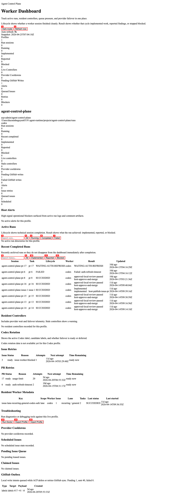
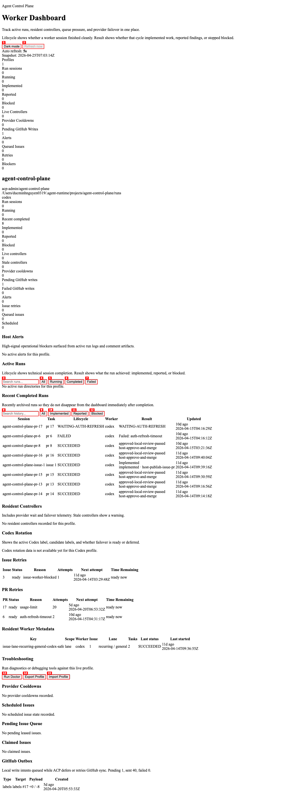

# ACP Worker Usage Examples

Real-world examples for each ACP worker type. Each example shows how to
initialize a profile, start the runtime, and observe ACP orchestrating issues
through the chosen backend.

---

## 1. Codex Worker — Simple Bug Fix

**Use case:** Delegate a small, well-scoped bug fix to OpenAI Codex.

**Requirements:** `OPENAI_API_KEY` exported in your environment.

```bash
# Initialize a profile pointing at your repo
agent-control-plane init \
  --profile-id my-project-codex \
  --repo-slug owner/my-project \
  --forge-provider github \
  --repo-root ~/src/my-project \
  --coding-worker codex

# Start the runtime (schedules heartbeats automatically)
agent-control-plane runtime start --profile-id my-project-codex

# Open the dashboard to watch progress
agent-control-plane dashboard start
# → http://127.0.0.1:8765
```

Create a GitHub issue with a label that ACP watches (e.g. `agent-task`).
ACP picks it up on the next heartbeat, launches a Codex worker session in a
tmux window, and emits a result artifact when done.

**Dashboard during work:**



---

## 2. Claude Worker — Refactoring Task

**Use case:** Run a multi-file refactoring using Anthropic's Claude.

**Requirements:** `ANTHROPIC_API_KEY` exported in your environment.

```bash
# Initialize a profile for the refactoring project
agent-control-plane init \
  --profile-id my-project-claude \
  --repo-slug owner/my-project \
  --forge-provider github \
  --repo-root ~/src/my-project \
  --coding-worker claude

# Start the runtime
agent-control-plane runtime start --profile-id my-project-claude

# Tail the runtime log to see launch events
agent-control-plane runtime logs --profile-id my-project-claude --follow
```

Label your refactoring issue `agent-task`. ACP launches a `claude` session
inside a dedicated worktree so the refactor cannot break the main branch.
When the session ends, ACP opens a draft PR automatically.

**Dashboard during work:**



---

## 3. Ollama Worker — Local Model

**Use case:** Run ACP entirely offline using a locally hosted model.

**Requirements:** [Ollama](https://ollama.ai) installed and a model pulled, e.g.
`ollama pull qwen2.5-coder:7b`.

```bash
# Pull a local coding model
ollama pull qwen2.5-coder:7b

# Initialize a profile using the ollama backend
agent-control-plane init \
  --profile-id my-project-ollama \
  --repo-slug owner/my-project \
  --forge-provider github \
  --repo-root ~/src/my-project \
  --coding-worker ollama

# (Optional) Set a preferred model in the profile config
# Edit ~/.agent-runtime/projects/my-project-ollama/profile.yaml:
#   ollama_model: "qwen2.5-coder:7b"

# Start the runtime
agent-control-plane runtime start --profile-id my-project-ollama
```

All traffic stays on your machine — no API keys required. ACP detects
the available context window by querying the Ollama `/api/show` endpoint
and adjusts chunk sizes automatically.

**Dashboard during work:**


---

## 4. Pi Worker — Free Tier

**Use case:** Use the free-tier Pi model via OpenRouter for low-cost automation.

**Requirements:** `OPENROUTER_API_KEY` exported in your environment
(free tier available at [openrouter.ai](https://openrouter.ai)).

```bash
# Initialize a profile with the pi backend
agent-control-plane init \
  --profile-id my-project-pi \
  --repo-slug owner/my-project \
  --forge-provider github \
  --repo-root ~/src/my-project \
  --coding-worker pi

# Start the runtime with conservative concurrency for free-tier rate limits
ACP_MAX_CONCURRENT_WORKERS=2 \
  agent-control-plane runtime start --profile-id my-project-pi

# Check runtime status
agent-control-plane runtime status --profile-id my-project-pi
```

The Pi worker is useful for triaging, labelling, and drafting small doc
improvements without spending API credits. Set `ACP_MAX_LAUNCHES_PER_HEARTBEAT=1`
if you hit rate limits.

**Dashboard during work:**


---

## Switching Workers

You can run multiple profiles with different workers against the same repo:

```bash
# Run codex for complex tasks and ollama for simple ones simultaneously
agent-control-plane runtime start --profile-id my-project-codex
agent-control-plane runtime start --profile-id my-project-ollama
```

Each profile maintains independent state, worktrees, and heartbeat schedules.

---

## See Also

- [Quick Start Guide](./QUICKSTART.md)
- [Demo Flows](./DEMO_FLOWS.md)
- [commands reference](../references/commands.md)
- [Architecture overview](../references/architecture.md)
