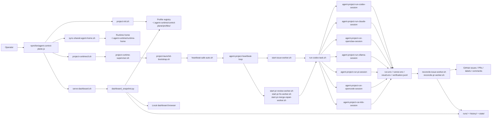
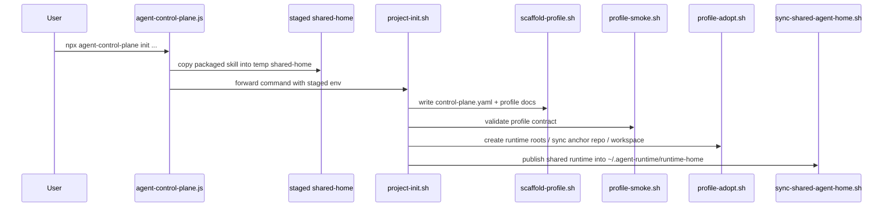
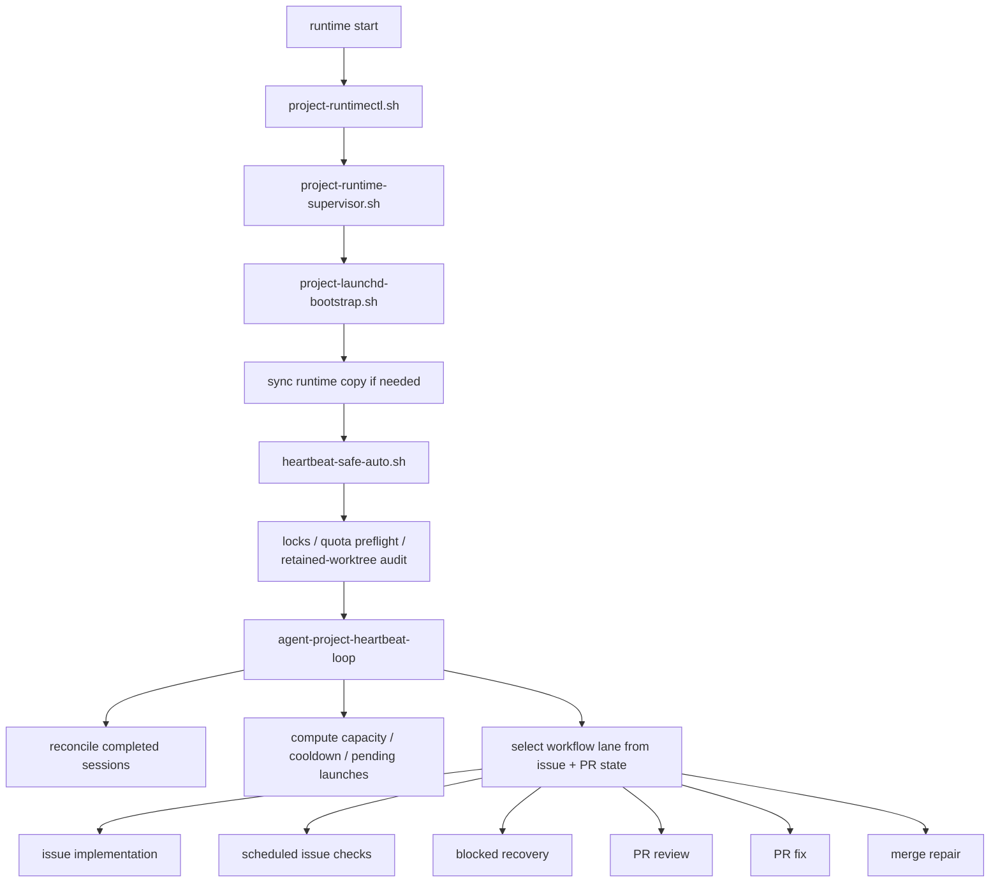
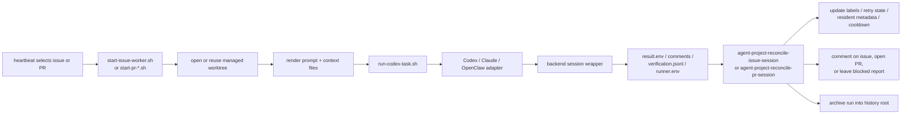
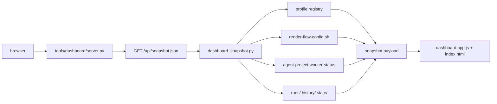

# Architecture Guide

This document explains how `agent-control-plane` is put together as an
operator-facing system, not just a collection of scripts.

ACP has five practical layers:

1. package entrypoint and staging
2. profile installation and publication
3. runtime supervision and heartbeat scheduling
4. worker execution and reconcile
5. dashboard and operator visibility

If you are reading the repo for the first time, start with the system overview
diagram below, then jump to the flow you care about most.

## System Overview

The important architectural choice is that ACP separates:

- package distribution from runtime execution
- shared engine logic from per-profile config
- worker execution from reconcile and GitHub side effects
- operator visibility from the worker CLIs themselves

## Install and Publication Flow

This is the path from `npx agent-control-plane ...` to a usable runtime on disk.

Why this split exists:

- the npm package is treated as a distribution artifact
- the real runtime is copied into `~/.agent-runtime/runtime-home`
- installed profiles live outside the package in
  `~/.agent-runtime/control-plane/profiles/<id>`
- upgrades are therefore explicit and repeatable instead of depending on a temp
  `npx` cache directory

## Runtime Scheduler Loop

This is the heartbeat path ACP follows after `runtime start`.

Key detail: the shared scheduler owns the control logic around workers:

- concurrency and heavy-worker limits
- cooldown and retry gating
- resident recurring and scheduled issue lanes
- launch ordering
- summary output and queue visibility

That is why workers do not need to be "smart" about the entire system. The
workflow around them carries a lot of the operational burden.

## Worker Session Lifecycle

This is the path from one chosen issue or PR to a reconciled outcome.

The contract here is deliberate:

- worker backends focus on producing work and result artifacts
- reconcile scripts own the final interpretation and GitHub-facing outcome
- resident metadata and history are updated by the host workflow, not by the
  worker trying to infer the entire system state

## Dashboard Snapshot Pipeline

The dashboard is a read-only window into ACP state. It does not own scheduling.

This means the dashboard reflects the current state of:

- installed profiles
- live and recent runs
- resident controller metadata
- provider cooldowns
- scheduled issue state
- runtime process status

without introducing a second control path that could drift away from the real
scheduler state.

## Reading Order

If you want the shortest path through the architecture:

1. [System Overview](#system-overview)
2. [Runtime Scheduler Loop](#runtime-scheduler-loop)
3. [Worker Session Lifecycle](#worker-session-lifecycle)
4. [Dashboard Snapshot Pipeline](#dashboard-snapshot-pipeline)

If you are changing packaging or onboarding, also read
[Install and Publication Flow](#install-and-publication-flow).
